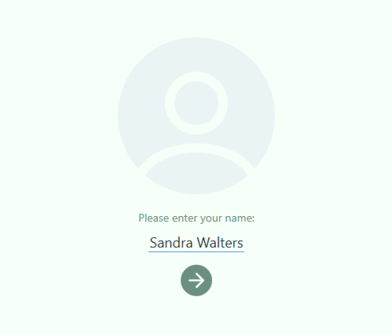
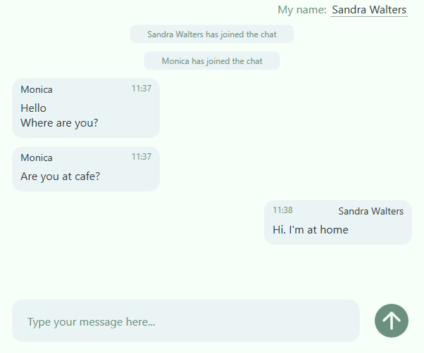

<h1 align="center">
  Web Chat
  
</h1>

  <a href="#-description">Description</a> •
  <a href="#-features">Features</a> •
  <a href="#-technologies">Technologies</a> •
  <a href="#-how-to-start-the-program">How to start the program</a> •
  <a href="#-screenshots">Screenshots</a>

## 📃 Description
Web Chat is a simple client-server application written in Java and C#/.Net.
The server part works at the address `ws://localhost:8080/chat`
Messages sent and received in `JSON` format.

## 🚀 Features
The program allows users to send messages to a group chat and see useful 
information about both new user connections and disconnections. 
The user has the opportunity to specify his name when connecting to 
the server and, if necessary, during the communication process.

## 🧑‍💻 Technologies
| Technology      | Version |
|:----------------|:--------|
| **Server**      |         |
| JDK             | 17      |
| Maven           | 4.0.0   |
| Spring Boot     | 3.0.1   |
| Lombok          | -       |
| Gson            | 2.10.1  |
| **Client**      |         |
| .Net            | 6.0     |
| WPF             | -       |
| Newtonsoft.Json | 13.0.2  |
| WebSocketSharp  | 1.0.0   |

## 📎 How to start the program
1. Clone the project from GitHub
2. Run server part of app
3. Download [client app](https://github.com/pavlogook/web-chat/releases/tag/v1.0.0)
4. To run client app you need to have on your computer installed [Windows Desktop Runtime 6.0.x](https://dotnet.microsoft.com/en-us/download/dotnet/6.0) 
or you can download portable [app with dependency](https://github.com/pavlogook/web-chat/releases/tag/v1.0.0)
5. Enjoy the program 😉

## ⭐ Screenshots
### Hello page

### Chat

